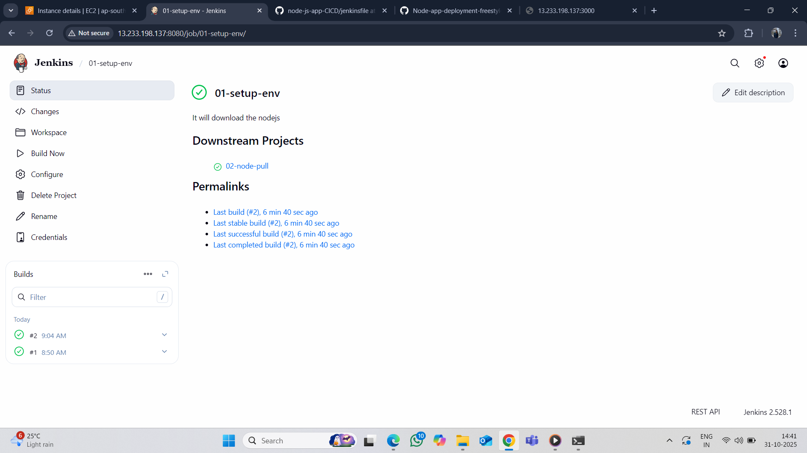
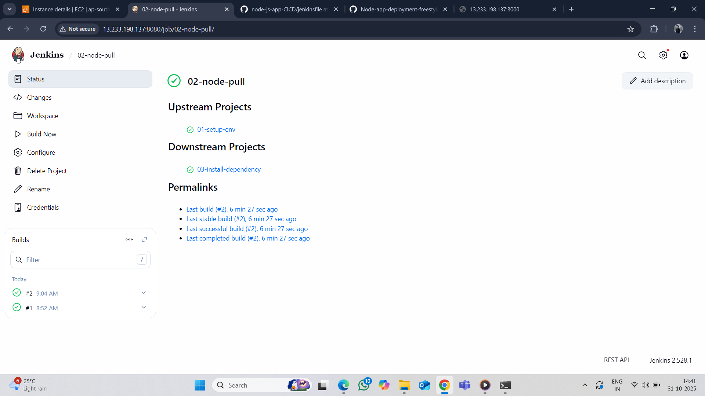
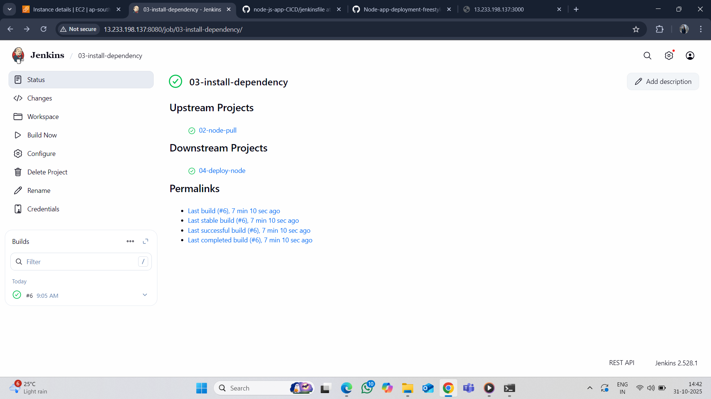
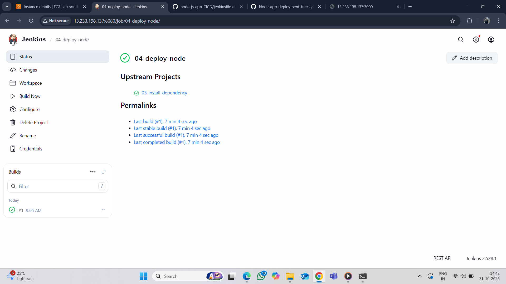
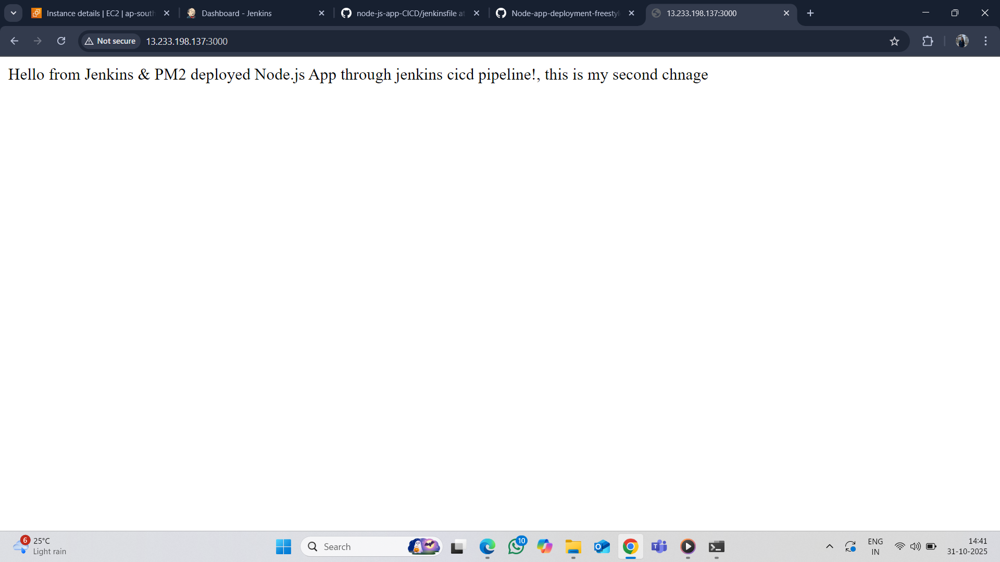

#  Node.js Application Deployment using Jenkins (Freestyle Project)

Devops project

## overview:

This project demonstrates how to automate the build, pull, test, and deployment of a Node.js application using Jenkins Freestyle Project.
It covers installing dependencies, running tests, and deploying the app on a server.
 

## Networking Configuration:
   Jenkins can access your GitHub repository and deployment server.
The Node.js application is reachable from your browser via a specific port (e.g., 3000 or 8080).

## Jenkins Freestyle Project Setup:

### Step 1: create a job (01-setup-env)

Open Jenkins Dashboard → New Item → Freestyle Project

Enter a project name (01-setup-env)

Execute shell write 
 sudo apt update
 sudo apt install nodejs -y
 sudo apt install npm -y
 sudo npm install -g pm2

post-build-action -> 02-node-pull

Click save

### Step 2 create a job (02-node-pull)

Open Jenkins Dashboard → New Item → Freestyle Project

source code mangement ->
Select Git ->
Enter your Repository URL (e.g., https://github.com/Sharayu1707/servless-photo-upload.git)

post-build-action -> 03-install-dependency

Click save

### Step 3 create a job (03-install-dependency)

Open Jenkins Dashboard → New Item → Freestyle Project

Execute shell write 
cd /var/lib/jenkins/workspace/02-node-pull

sudo npm install

post-build-action -> 04-deploy-node

Click save

### Step 4 create a job (04-deploy-node)

Open Jenkins Dashboard → New Item → Freestyle Project

Execute shell write 

cd /var/lib/jenkins/workspace/02-node-pull

pm2 start app.js --name node-app || pm2 restart node-app

post-build-action -> 04-deploy-node

Click save

### Step 5 Build step 

go to jenkins dashboard -> click on first job (01-setup-env) > click on Build now

### Step 6 Output

copy pubilcIP -> paste to browser and port 3000.

e.g http://publicIP:3000

## Service used

GitHub – copy repo 

Jenkins – Automates build, pull, test, and deployment

Node.js & npm – Run app and manage dependencies

AWS EC2 – Hosts Jenkins and the Node.js app

Ubuntu – Server OS for deployment

 PM2 – Keep app running continuously

## Project Summary

This project automates the deployment of a Node.js application using Jenkins Freestyle Project.

Jenkins pulls the source code from GitHub, installs dependencies using npm, and deploys the app on an Ubuntu-based AWS EC2 instance.
The application runs continuously in the background using PM2, ensuring high availability even after restarts.

## Advantages

Simple to Set Up – Easy graphical interface; no scripting required.

Beginner-Friendly – Great for learning CI/CD basics.

Quick Configuration – Setup build steps like Git pull, npm install, and deploy in minutes.

Supports Plugins – Can integrate with GitHub, Slack, AWS, etc.

Customizable Build Steps – You can easily add shell commands or scripts.

Good for Small Projects – Ideal for single-branch or standalone deployments.

## Disadvantages

Limited Scalability – Hard to manage complex pipelines or multiple environments.

No Code-Based Pipeline – Lacks version control for pipeline configuration (unlike Jenkinsfile).

Manual Maintenance – Each job must be configured separately.

Error-Prone – Harder to debug or replicate builds across environments.

Not Ideal for Large CI/CD Pipelines – Better to use Pipeline (Declarative or Scripted) for advanced automation.

## Outcome

✅ Automated build and deployment pipeline for Node.js app.

✅ Continuous Integration setup via Jenkins.

✅ Application deployed and running automatically after each commit.

